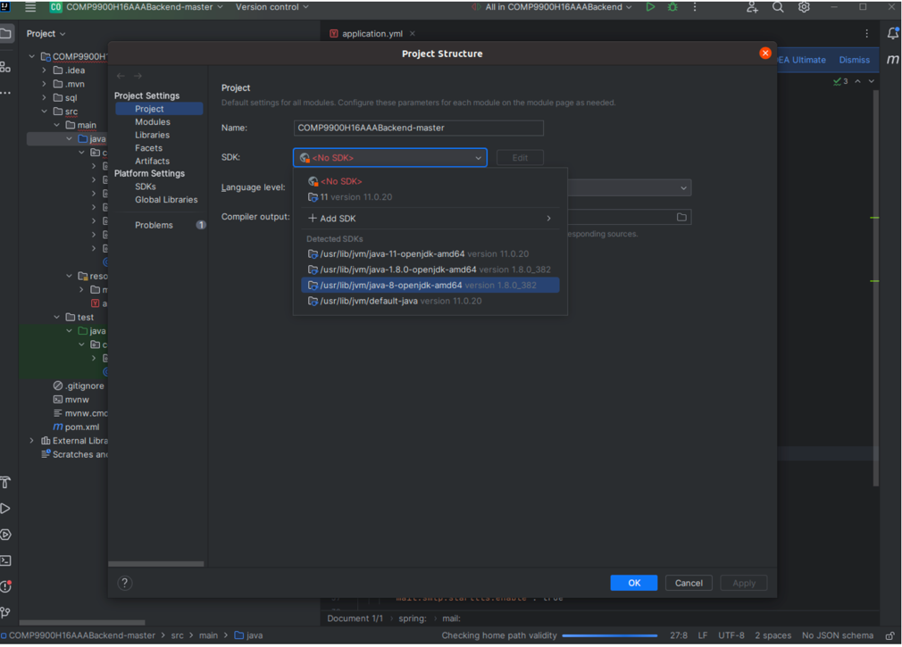

# capstone-project-9900h16aaa

## 1. Project Description
Our project is to design and implement a ESG Management Platform, and it could simply to divide into two parts: backend and frontend.

## 2. Backend Start Instruction
### 2.1 Install MySQL
(!Please open the terminal and execute the following commands.)

#### Install MySQL on Mac
Install homebrew if you haven't installed it before.
```bash
/bin/bash -c "$(curl -fsSL https://raw.githubusercontent.com/Homebrew/install/HEAD/install.sh)"
```

```bash
brew install mysql
```

#### Install MySQL on Windows
Download MySQL installer from [MySQL official website](https://dev.mysql.com/downloads/installer/).

#### Install MySQL on Linux
```bash
sudo apt-get update
sudo apt-get install mysql-server
```

### 2.2 Start MySQL
#### Start MySQL on Mac
```bash
brew services start mysql
```

#### Start MySQL on Windows
```bash
net start mysql
```

#### Start MySQL on Linux
```bash
sudo systemctl start mysql
```

### 2.3 Login MySQL
```bash
mysql -u root -p
```

### 2.4 Change MySQL Password 
(Just use 'root' as the new password. Otherwise, you need to change settings in the COMP9900H16AAABackend-master/src/main/resources/application.yml.) 
```bash
ALTER USER 'root'@'localhost' IDENTIFIED BY 'new_password';
```

#### Login MySQL with New Password
```bash
mysql -u root -p
```

### 2.5 Create Database
```bash
CREATE DATABASE esg;
```

### 2.6 Create tables

```bash
use esg;
```

```bash
source <path-to-repo>/COMP9900H16AAABackend-master/sql/create_table.sql;
```

### 2.7 Install IntelliJ IDEA and run backend application
### 2.7.1 Install IntelliJ IDEA
Download IntelliJ IDEA from [IntelliJ IDEA official website](https://www.jetbrains.com/idea/download/#section=mac).

### 2.7.2 Open IDEA
For Windows users: After installing IntelliJ, simply double-click on the idea.exe file to launch the application. 

Mac OS users can locate IntelliJ IDEA CE in their Applications folder and click on it to start the program. 

Ubuntu users should execute the following command in their terminal to run IntelliJ IDEA

### 2.7.3 Import Project
Click on the Import Project option on the Welcome Screen, or go to File | Open and select the project's root folder.

### 2.7.4 Change MySQL Password in IntelliJ IDEA:
1. Open the project in IntelliJ IDEA.
2. Open the file COMP9900H16AAABackend-master/src/main/resources/application.yml.
3. Change the password in the line 24 to the new password you set in 2.4.
(If you have set the password as 'root' in 2.4, you can skip this step.)

#### 2.7.5 Download Dependencies
1. Right-click on the ‘./pom.xml’ file within IntelliJ, then navigate to and select ’Maven’ followed by ’Download Sources and Documentations’. Allow some time for all the downloads to complete.


#### 2.7.6 Configure Java SDK
1. To configure the Java SDK for the project in IntelliJ
2. Go to 'Settings'
3. Then navigate to 'Project Settings', followed by 'Project'. 
4. Here, select the Java SDK 8/1.8 for the project, similar to the example shown in Figure


#### 2.7.7 Run the Application
1. To run the application, right-click on the './COMP9900H16AAABackend-master/src/main/java/com.unswesg.comp9900h16aaabackend/Comp9900H16AaaBackendApplication.java' file within IntelliJ, then navigate to and select Run.


## 3. Frontend Start Instruction
Execute the following commands in the IDEA terminal under this project.
#### Enter Frontend Directory
```bash
cd COMP9900_AAA_ESG_Frontend-main/myapp
```

#### Create Git Repository
```bash
git init
```

#### Environment Prepare

Install `node_modules`:

```bash
npm install
```

or

```bash
yarn
```

#### Provided Scripts


Scripts provided in `package.json`. It's safe to modify or add additional script:

#### Start project

```bash
npm start
```

#### Build project

```bash
npm run build
```

